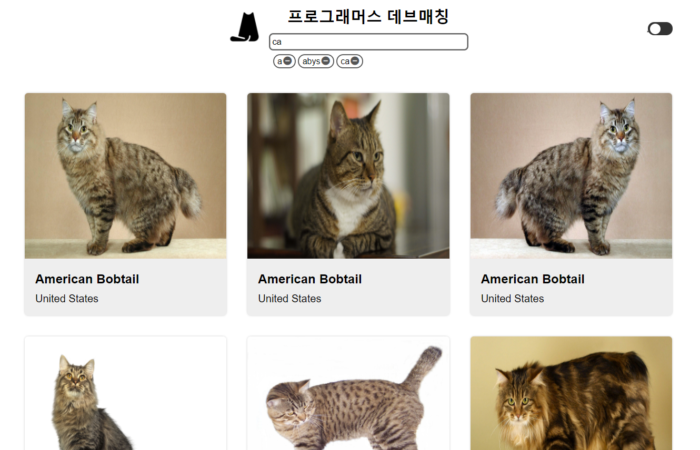

## 08/31

1. 현재 lazyloading 문제점
  - data를 fetch할 때 request에 요청되는 시간 동안의 fallback
  - image를 painting할 때 flickering
    - image alt src를 주어야할 듯.
    - alt src image 대신 <div class="palceholder">로 구현해보려함.
    - image를 request하는 시점에서 placeholder를 띄우고
    - lazyLoading에서 placeholder를 숨긴 후 image에 src를 달아줌.
2. 


content1
  modal-1
content2
  modal-2
content3
  modal-3


## to do

data 구조 바꾸기
- 비동기 관련된 데이터 처리
- global accessible data
searchBar 컴포넌트 쪼개기
이미지 페이지네이션
placeholder 이미지 개선
main 컴포넌트, searchbar 컴포넌트, API 관계 정리
메소드 정리하기


## js 파일 구조

```

  📂api
  📂component
    - Component.js
      - config
        - $parent
        - className
        - attribute
        - position
        - handler
        - 추가적인 옵션이 있을 경우 config에 정의한 후 상위에서 config를 통해 전달
      - setClassName
      - setAttribute
      - mountDOM  
        - 인스턴스 당 하나의 DOM element를 가지며
        - new를 통한 인스턴스 생성 시 super()를 통해 config에서 설정한 $parent에 append됨
    - header
      - Header.js
      - Logo.js
      - SearchBar.js
        - input, badge, title로 컴포넌트화하면 좋다 생각됐지만 귀찮아서 pass
        - input 입력 발생 시 App에서 관리하는 searchedKeywords를 업데이트하며
        - main render handler를 전달받아 handler로 실행
        - 첫 시도에서는 SearchBar에서 API를 이용해 데이터를 긁었는데, 이를 Main에 전달할 방법이 없다 생각했음.(App에서 data를 관리하면 가능)
        - search 컴포넌트(control)를 만들어서 App에서 관리하고 view와 control을 구분하면 좋을 듯 (이게 mvc인가..?)
        - search 컴포넌트에서 catAPI를 활용해서 data를 가공하고 main에서 가공된 data를 받아 render 가능한 데이터로 처리한 후 render한다면?
      - Switch.js
        - darkMode에 사용할 스위치버튼
    - Main.js
      - fetchCatsInfo
        - API에서 불러오는 data를 render에 알맞는 data로 가공
      - renderCatCards
        - fetch한 catsInfo를 통해 cards를 렌더링
      - showCatCardsFallback
        - user가 입력한 input에 대한 data가 없을 경우 API에서 제공하는 breeds를 fallback 화면으로 제공
    - Modal.js
      - Main / Header에서 이벤트가 발생할 경우 
      - App의 데이터 상태를 변경하여 Modal에서 show/hide
  📂data
    - sessionStorage.js
      - session storage를 관리
    - searchedKeyword.js
      - App에서 관리할 data
      - App에서 관리할 data가 증가할 경우 한 객체에서 data를 관리할 것
      - 서로 다른 parent를 갖는 App 하위 컴포넌트 간에 데이터를 공유해야될 경우,
      - App에서 data를 관리하면 하위로 해당 data를 전달할 수 있게 되며
      - 하위 컴포넌트에서 set()메소드를 통해 data를 업데이트할 경우
      - 다른 컴포넌트에서 가지고 있는 데이터 또한 업데이트됨.
    - ID.js
      - unique한 session key를 생성하기 위해 ID generator를 적용해봤지만
      - server단에서 처리해야할 듯(?)
  📂template
    - 추가 예정
    - App.js에서 사용할 temp/main/modal 템플릿 제공
  📂utils
    - debounce.js
      - 불필요한 api 요청을 최소화하기 위해 사용
    - lazyLoading.js
      - 추가할 것
    - ID.js
      - unique한 ID 생성
```

## tempComponent구조로 다시 생각해보기
<!-- ```js
function Component(config) {
  const {
    $target,
    className = "modal",
    shouldRender = true,
  } = config;
  this.$target = $target;
  this.className = className;

  this.createElement = (tag) => {
    this.$el = document.createElement(tag);
    this.$el.className = this.className;
    this.children = [
      new childComponent({ $target: this.$el, className: "child" }),
    ];
    this.children.forEach((child) => child.render());
  };

  this.mountComponent = () => {
    this.state = {
        state1: true,
        state2: 'state'
    };

    this.handleState = {
      state1: () => {
      },
      state2: () => {
      },
    };

    this.createElement();
    this.render();
  };

  this.render = () => {
    if (!this.$el) {
      this.mountComponent();
    }

    this.reflect({ $content: this.state.$content });

    this.$target.append(this.$el);
  };

  this.reflect = (states) => {
    for (const state in states) {
      const handleNewState = this.handleState[state];
      handleNewState();
    }
  };

  this.setState = (states) => {
    for (key in states) {
      this.state[key] = states[key];
    }
    this.reflect(states);
    this.render();
  };

  if (shouldRender) {
    this.render();
  }
}
```

Component life cycle

mountComponent // initiated by render method
    createElement
    render
        reflect
        $target.append($this.el)

setState
    setstates // reassign new states to this.state
    reflect // execute handleState method
    render

render
    reflect
    render

createElement
- render() 메소드에서 this.$el 유무를 확인하고 createElement를 실행하므로
- 컴포넌트는 인스턴스 1개당 단 하나의 DOM element를 갖는다.

mountComponent
- 1회 실행되며 컴포넌트의 state가 필요할 경우 state와 state가 update될 경우 실행할 handler를 handleState로 저장한다.
- 

## extends to Component

```js
class myComponent extends Component{
    constructor($target, config){
        super($target, config);
    }
}
```

$target : DOM Element *
config : Object (like props)
    - tag *
    - attributes
    - handlers
    - shouldRender

## state in Component

```js
import handlers from './ParentComponent.js';

class myComponent{
    constructor($target, config){
        super($target, config);
        this.state = {
          modalBtnToggled: [false, handlers.showModal],
          popUpToggled: [true, handlers.showPopUp]
        }
    }
}
```

## default config

```js
import Component from "./Component";

export default class Container extends Component {
  constructor($target, config) {
    // declare def variables
    const defTag = "div";
    const defClassName = "container";   

    this.state = {
      modalBtnToggled: [false, handlers.showModal],
      popUpToggled: [true, handlers.showPopUp]
    }

    super($target, { tag: defTag, className: defClassName, ...config }); // def can be overwritten by config
  }
}
```

- you can use def values directly in super method
```js
import Component from "./Component";

export default class Container extends Component {
  constructor($target, config) {

    this.state = {
      modalBtnToggled: [false, handlers.showModal],
      popUpToggled: [true, handlers.showPopUp]
    }

    super($target, { tag: 'div', className: 'container', ...config }); // def can be overwritten by config
  }
}
```

session Storage

상위 컴포넌트에서 해결할 경우 사용할 메소드 지정 후 메소드를 넘기면 됨

하위에서 직접적으로 사용할 경우 스토리지 포인터를 넘기면 됨 -->